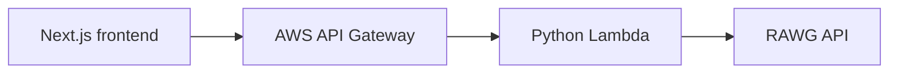

# RAWG Games

RAWG Games is a responsive game-discovery application built with Next.js and TypeScript. It retrieves game data through an AWS serverless integration consisting of API Gateway and Python Lambda functions, which communicate with the RAWG API.

---

## Live Demo

- Live deployment: [rawg-games-xi.vercel.app](https://rawg-games-xi.vercel.app)

> [!NOTE]
> Live deployment availability depends on the status of the backing AWS API Gateway and Lambda endpoints.

---

## Features

- **Responsive Game-List Interface**: Clean multi-column grid layout adapting seamlessly across mobile, tablet, and desktop viewports.
- **Game Information Cards**: Overview cards displaying cover artwork, user ratings, genre tags, and release dates.
- **Debounced Search**: Search input with a 2-second debounce (`lodash.debounce`) to optimize query dispatching as users type.
- **Previous/Next Pagination**: Pagination controls that handle page navigation via AWS API Gateway responses.
- **Dynamic Game-Detail Pages**: Slug-based dynamic routing (`/game/[game_slug]`) providing in-depth title details.
- **Rich Metadata Display**: Detail views presenting ratings, genres, website information, developer credits, and sanitized descriptions.
- **External Game Website Links**: Direct links to official game publisher websites.
- **Sanitized HTML Descriptions**: Safe rendering of RAWG rich text descriptions using DOMPurify to prevent XSS.
- **Optimized Remote Images**: Configured Next.js Image component (`next/image`) with `media.rawg.io` domain support.
- **AWS API Gateway Integration**: Centralized public HTTP endpoint routing requests to serverless Lambda functions.
- **Python Lambda Handlers**: Dedicated Lambda functions handling game list/search queries and game detail retrieval.

---

## Architecture



### Component Responsibilities

- **Next.js Frontend**: Renders the responsive UI, manages client search and pagination state, and dispatches requests to the API Gateway.
- **AWS API Gateway**: Serves as the public HTTP interface, receiving frontend requests and routing them to the appropriate Lambda function.
- **Python Lambda**: Serverless backend handlers that process list, search, and detail requests.
- **Secure Key Access**: The Python Lambda securely retrieves the RAWG API key from its AWS Lambda environment configuration (`os.environ`), preventing credential exposure in frontend bundles.
- **RAWG API**: External video game database supplying catalog data and metadata.
- **Response Flow**: Upstream data is returned from RAWG through Lambda and API Gateway back to the Next.js client application.

---

## Technology Stack

| Layer / Tool | Technology | Purpose |
|---|---|---|
| Frontend Framework | Next.js 15 (Pages Router) | React application framework and routing |
| UI Library | React 19 | Component-based user interface |
| Language | TypeScript 5.7 | Type definitions and static typing |
| Styling | Tailwind CSS 3.4 | Utility-first CSS styling and layout |
| Icons | FontAwesome 6.7 | Navigation, menu, home, and back icons |
| HTTP Client | Axios 1.8 | Client-side HTTP requests |
| HTML Sanitization | DOMPurify 3.2 | Sanitizing RAWG HTML game descriptions |
| Utilities | Lodash 4.17 | Debouncing search inputs |
| API Gateway | AWS API Gateway | Public REST API endpoints and request routing |
| Serverless Compute | AWS Lambda (Python) | Backend handlers for RAWG queries |
| Data Provider | RAWG API | Video game database |
| Deployment | Vercel | Frontend hosting and edge delivery |

---

## Application Flow

### 1. Game Listing and Search
1. The user navigates to the home page (`/`) or enters a search query.
2. Search input changes trigger a debounced query handler.
3. Axios sends a `GET` request to `${NEXT_PUBLIC_API_GATEWAY_HOST}games?page_size=12[&search=...][&page=...]`.
4. AWS API Gateway invokes the game-list Lambda function (`fetchAllGame.py`).
5. Lambda injects the private RAWG API key and queries the RAWG API (`https://api.rawg.io/api/games`).
6. The JSON payload is returned through API Gateway to the frontend, which renders the game cards and updates pagination links.

### 2. Game Details
1. The user selects a game card, navigating to `/game/[game_slug]`.
2. Next.js extracts `game_slug` from the route and sends a `GET` request to `${NEXT_PUBLIC_API_GATEWAY_HOST}${game_slug}`.
3. AWS API Gateway invokes the game-detail Lambda function (`fetchGameDetail.py`).
4. Lambda queries `https://api.rawg.io/api/games/{game_slug}` with the private RAWG API key.
5. The frontend receives the game metadata, sanitizes the description with DOMPurify, and renders the detail view.

---

## Local Setup

### Prerequisites
- Node.js (v18 or higher recommended)
- npm

### Installation

1. Clone the repository:
   ```bash
   git clone https://github.com/Abhishekumar93/rawg-games.git
   cd rawg-games
   ```

2. Install dependencies:
   ```bash
   npm ci
   ```

3. Configure environment variables:
   ```bash
   cp .env.example .env.local
   ```

4. Start the development server:
   ```bash
   npm run dev
   ```

5. Open [http://localhost:3000](http://localhost:3000) in your browser.

---

## Environment Variables

Create a `.env.local` file in the project root:

```env
NEXT_PUBLIC_API_GATEWAY_HOST=https://your-api-gateway-domain/prod/
```

> [!IMPORTANT]
> - **Trailing Slash**: The trailing slash (`/`) is required due to the frontend URL construction (`${process.env.NEXT_PUBLIC_API_GATEWAY_HOST}games...`).
> - **API Gateway Base URL**: This variable must only contain the public AWS API Gateway endpoint URL.
> - **No RAWG Key in Frontend**: The RAWG API key must **never** be placed in frontend environment variables. It belongs strictly in the AWS Lambda environment configuration.

---

## Companion Serverless Repository

The backend Lambda functions and API Gateway integration are maintained in a companion repository:

- Repository: [Abhishekumar93/api-gateway-game-list](https://github.com/Abhishekumar93/api-gateway-game-list)

It contains two Python Lambda handlers:
- `fetchAllGame.py`: Handles searchable and paginated game list queries.
- `fetchGameDetail.py`: Handles individual game detail lookups by slug.

---

## Project Scope

This repository is retained as a focused portfolio demonstration of a Next.js frontend integrated with an AWS serverless API layer.

Key areas demonstrated:
- Responsive Next.js UI development and routing
- Third-party API consumption through an AWS serverless proxy
- Decoupling frontend presentation from upstream API credentials
